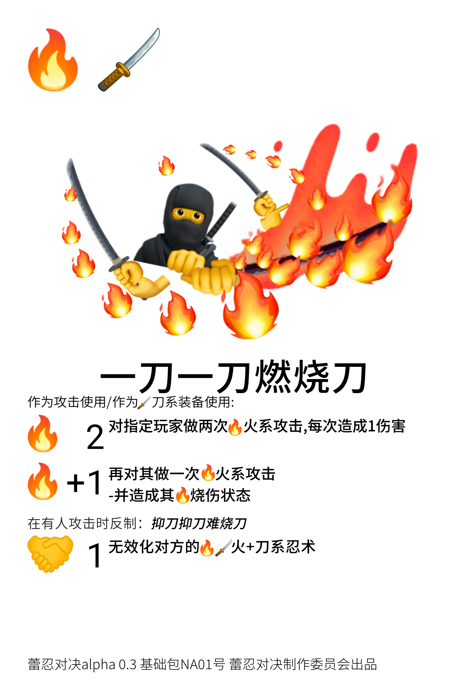

# 蕾忍对决卡牌编辑器
其实还没完成（（（
## Sample 
   
   大概就是这个样子
## Howto Guide
   安装Node.js LTS\
   克隆这个储存库\
   运行start.bat或者start.sh
## 已知问题
卡牌效果为3个时的模板没敲定，事实上这种卡图想找一个规范还挺麻烦的（碎碎念），所以代码还需改进
## 忍术来源于[蕾忍宗](https://www.wsfrs.com/)
